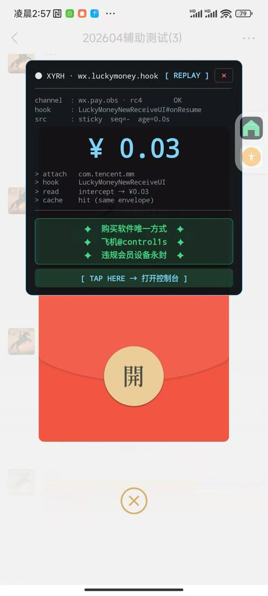
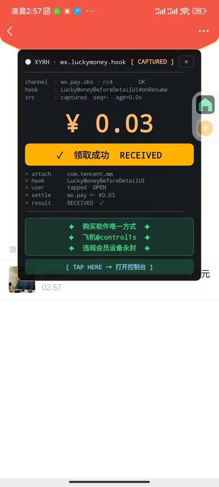
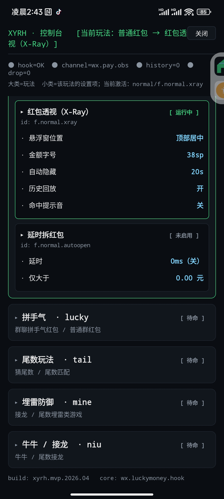

#Code微信红包透视辅助外挂
最新版 20260425 已上线
可以支持任何测试。
telegram@control1s

以下测试是在群内发的3个人的红包，随机发0.03的总额，发送过去的一瞬间就可以提前看到答案了。

#### 效果预览

##前言
微信红包透视辅助外挂是我在2015年春节过年期间编写的一个开源的兴趣项目，只要是将整个核心抢红包的流程编写出来，至于再复杂的一些操作就没深入研究。当这个项目发布后，也是反应挺大的，很多网友也找到我了与交流，也有做淘宝的人给钱让我去增加一些功能，当然我是拒绝的。而本文通过抢红包这个示例去讲解AccessibilityService的用途，希望大家能举一反三去学习这个辅助服务的强大之处。

##免责声明
本软件仅供学习使用，完全模拟人工操作，禁止使用本软件参与赌博活动。一切因使用“微信红包透视辅助外挂”造成的任何后果，微信红包透视辅助外挂概不负责，亦不承担任何法律责任!

##技术详述
一开始大家都会觉得做一个Android外挂会汲取很多东西或者底层的东西,但当发现Android里有一个叫`AccessibilityService`的服务时，一切都变得很简单。

###关于AccessibilityService

先看看官网的介绍Accessibility  
Many Android users have different abilities that require them to interact with their Android devices in different ways. These include users who have visual, physical or age-related limitations that prevent them from fully seeing or using a touchscreen, and users with hearing loss who may not be able to perceive audible information and alerts...

[Android官网详解accessibility](http://developer.android.com/guide/topics/ui/accessibility/index.html)

上面大概的意思就是Accessibility是一个辅助服务，主要是面向一些使用Android手机的用户有相关障碍(年龄、视觉、听力、身体等)，这个功能可以更容易使用手机，可以帮用户在点击屏幕或者显示方面得到帮助等等。接下来就是查找相关API，看能做到哪个地步。

[Accessibility相关API描述](http://developer.android.com/guide/topics/ui/accessibility/apps.html)

当然`accessibility`除了可以辅助点击界面的事件外，还可以用作自动化测试，或者一键返回，是一个非常强大与实用的功能，具体实例可以看我另一个App`虚拟按键助手` 请往下载 [GooglePlay市场](https://play.google.com/store/apps/details?id=com.leon.assistivetouch.main) 或 [应用宝](http://android.myapp.com/myapp/detail.htm?apkName=com.leon.assistivetouch.main)。

###关于抢红包的流程
在有以上的一些关于辅助服务的基础知识后，我们就可以分析怎样自动化抢红包。
大家使用过微信都知道，如果不是在微信的可见界面范围（在桌面或者在使用其它应用时），在收到新的消息，就会在通知栏提醒用户。而在微信的消息列表界面，就不会弹出通知栏，所以可以区分这两种情况。然后抓取相关关键字作进一步处理。

1、在非微信消息列表界面，收到通知消息的事件，判断通知栏里的文本是否有[微信红包]的关键字，有则可以判断为用户收到红包的消息(当然，你可以故意发一条包括这个关键字的文本消息去整蛊你的朋友)。然后，我们就自动化触发这个消息的意图事件(`Intent`);

2、在通知栏跳进微信界面后，是去到`com.tencent.mm.ui.LauncherUI`这个`Activity`界面。我们知道，红包的消息上，包括了关键字`领取红包`或者`View`的`id`，那我们就根据这个关键字找到相应的`View`，然后再触发`ACTION_CLICK`(点击事件);

3、在点击红包后，会跳到`com.tencent.mm.plugin.luckymoney.ui.LuckyMoneyReceiveUI`这个拆红包的`Activity`,当然老方法，找关键字`拆红包`或`id`,然后触发自动化点击事件。

这样就可以完成整个自动化完成抢红包的流程了,所以核心就是找关键字，然后模拟用户点击事件，就这么简单。以下详细说一下代码的实现。

以下是通过`DDMS`工具里的`Dump View Hierarchy For UI Automator` 去分析微信UI结构。

###使用AccessibilityService去一步步监听微信的动作
1、新建一个继承`AccessibilityService`的类,如`QiangHongBaoService`，然后在`AndroidManifest.xml`里声明组件，如下

    <service
            android:label="@string/app_name"
            android:name=".QiangHongBaoService"
            android:permission="android.permission.BIND_ACCESSIBILITY_SERVICE">
            <intent-filter>
                <action android:name="android.accessibilityservice.AccessibilityService"/>
            </intent-filter>
            <meta-data
                android:name="android.accessibilityservice"
                android:resource="@xml/qianghongbao_service_config"/>
        </service>

在meta-data里声明的是辅助配置，这个是Android4.0之后才支持的写法，在4.0之前的系统要在代码里声明。

2、在`res/xml`目录下生成辅助服务的配置文件`qianghongbao_service_config.xml`

    <accessibility-service
    xmlns:android="http://schemas.android.com/apk/res/android"
    android:description="@string/accessibility_description"
    android:accessibilityEventTypes="typeNotificationStateChanged|typeWindowStateChanged"
    android:packageNames="com.tencent.mm"
    android:accessibilityFeedbackType="feedbackGeneric"
    android:notificationTimeout="100"
    android:accessibilityFlags=""
    android:canRetrieveWindowContent="true"/>

`android:description` 这个是设置服务的描述，在用户授权的界面可以看到。

`android:accessibilityEventTypes` 这个是配置要监听的辅助事件，我们只需要用到`typeNotificationStateChanged`(通知变化事件)、`typeWindowStateChanged`(界面变化事件)

`android:packageNames` 这个是要监听应用的包名，如果要监听多个应用，则用`,`去分隔，这里我们只需要监听微信的就可以了

`android:accessibilityFeedbackType` 这个是设置反馈方式

FeedbackType | 描述 
------------ | ------------- 
feedbackSpoken | 语音反馈 
feedbackHaptic | 触感反馈
feedbackAudible | 表示声音(不是语音)反馈
feedbackVisual | 视觉反馈
feedbackGeneric | 通用反馈
feedbackAllMask | 所有以上的反馈

[详细看AccessibilityServiceInfo类文档描述](http://developer.android.com/reference/android/accessibilityservice/AccessibilityServiceInfo.html)

3、在以上都配置好后，我们就可以在`QiangHongBaoService`这个服务里进行编码了，要做的就是将整个UI跳转流程与逻辑串联起来。

    @Override
    public void onAccessibilityEvent(AccessibilityEvent event) {
		//接收事件,如触发了通知栏变化、界面变化等	
    }
    
    @Override
    protected boolean onKeyEvent(KeyEvent event) {
        //接收按键事件
        return super.onKeyEvent(event);
    }

    @Override
    public void onInterrupt() {
	  //服务中断，如授权关闭或者将服务杀死
    }

    @Override
    protected void onServiceConnected() {
        super.onServiceConnected();
        //连接服务后,一般是在授权成功后会接收到
    }

##关于作者
最新版 20260425 已上线
可以支持任何测试。
telegram@control1s
